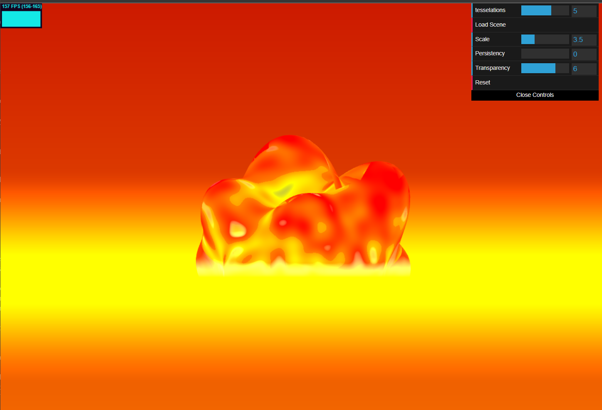

# [Project 1: Noise](https://github.com/CIS-566-Fall-2022/hw01-fireball-base)
## [Live Demo](https://danielzhong.github.io/hw01-fireball/)

## Fireball scene features:
* Perlin Noise Generation: A gradient noise function that produces natural-looking patterns, layered over multiple octaves for added complexity(FBM).

* Triangle Wave: A non-sinusoidal waveform producing a triangular shape.

* Base and Fractal Waves: Two distinct wave patterns; a low-frequency, high-amplitude base wave and a high-frequency, low-amplitude fractal wave.

* Bias and Gain Adjustments: Functions that reshape the transition curve.

* Dynamic Displacement: Vertex displacements are computed using a combination of wave patterns, Perlin noise, and vertex normals to simiulate fire looking.

* Fragment Color Interpolation: colors are adjusted based on Perlin noise values and displacements, transitioning through a gradient of cool to warm colors using smootherstep function.

* Time Dependency: The shaders are animated and dynamic utalized sin function, with patterns and displacements evolving over time.

* Background: Mix red and yellow color based on screen height position, and add glow effect using smoothstep function